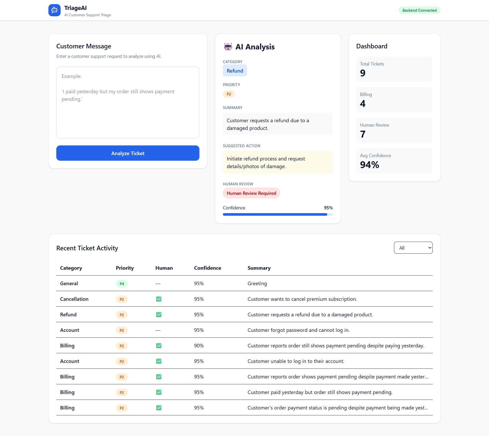

## 📚 Documentation

- **Project Overview:** `README.md`
- **Frontend Documentation:** `client/README.md`
- **Backend Documentation:** `server/README.md`


# 🤖 TriageAI


> AI-powered customer support ticket triage system built for the Gateway Hackathon.



## 📑 Table of Contents

- Overview
- Features
- Architecture
- Project Structure
- Tech Stack
- Security
- Dashboard
- AI Workflow
- REST API
- Evaluation
- Getting Started
- Future Improvements
---

# 📖 Overview

Customer support teams receive hundreds of tickets every day. Manually categorizing, prioritizing, and routing them is repetitive, slow, and error-prone.

**TriageAI** automates this process using Google's Gemini AI by transforming an unstructured customer message into structured support metadata.

For every customer request, the system automatically determines:

- Ticket Category
- Priority (P1–P4)
- AI-generated Summary
- Suggested Resolution
- Human Escalation Requirement
- Confidence Score

Every analyzed ticket is validated, stored in MongoDB Atlas, and visualized through a React dashboard.

---

# ✨ Features

## AI Features

- 🤖 Automatic ticket classification
- 🚨 Priority prediction
- 📝 AI-generated summaries
- 💡 Suggested agent action
- 👤 Human review prediction
- 📊 Confidence scoring

---

## Backend Features

- Express REST API
- Prisma ORM
- MongoDB Atlas
- Zod validation
- Repository pattern
- Centralized error handling
- Health endpoint
- Retry mechanism for Gemini API failures
- Secure HTTP headers using Helmet
- CORS support
- Morgan request logging

---

## Frontend Features

- Responsive React dashboard
- AI Analysis panel
- Dashboard statistics
- Ticket history
- Ticket filtering
- Loading states
- Empty states

---

# 🏗 System Architecture

```text
Customer Message
        │
        ▼
React Dashboard
        │
        ▼
Axios API Client
        │
        ▼
Express REST API
        │
        ▼
Request Validation (Zod)
        │
        ▼
Google Gemini
        │
        ▼
Response Validation
        │
        ▼
Repository Layer
        │
        ▼
Prisma ORM
        │
        ▼
MongoDB Atlas
        │
        ▼
Dashboard
```

---

# 📂 Project Structure

```text
TriageAI
│
├── client/               React Frontend
│
├── server/               Express Backend
│   ├── config/
│   ├── controllers/
│   ├── middleware/
│   ├── repositories/
│   ├── routes/
│   ├── services/
│   ├── utils/
│   └── prisma/
│
└── database/
    ├── sampleTickets.json
    └── testRunner.js
```

---

# ⚙ Tech Stack

## Frontend

- React
- Vite
- Tailwind CSS
- Axios

## Backend

- Node.js
- Express.js
- Prisma ORM
- MongoDB Atlas

## AI

- Google Gemini 2.5 Flash Lite

## Utilities

- Zod
- Helmet
- CORS
- Morgan

---

# 🔐 Security

Although this is a hackathon project, several production-inspired practices have been implemented.

### Helmet

Adds secure HTTP headers to reduce common web vulnerabilities.

### CORS

Allows secure communication between the React frontend and Express backend during development.

### Zod Validation

Validates both incoming API requests and AI-generated responses before database insertion.

### Repository Pattern

Separates business logic from persistence, improving maintainability and testability.

---

# 📊 Dashboard

The dashboard provides:

- Customer message submission
- AI-generated analysis
- Ticket statistics
- Ticket history
- Human review indicators
- Confidence visualization

---

# 🤖 AI Workflow

```text
Customer Message

↓

Gemini Prompt

↓

Structured JSON

↓

Zod Validation

↓

MongoDB

↓

Dashboard
```

---

# 📡 REST API

## Analyze Ticket

```
POST /api/v1/triage
```

Analyzes a customer support message using Gemini AI.

---

## Get All Tickets

```
GET /api/v1/triage
```

Returns every analyzed ticket.

---

## Get Ticket by ID

```
GET /api/v1/triage/:id
```

Returns a single ticket.

---

## Health Check

```
GET /health
```

Returns server status.

---

# 🧪 Evaluation

The repository includes an automated evaluation script.

```
database/
└── testRunner.js
```

The script sends multiple customer messages to the API and measures:

- Classification Accuracy
- Priority Prediction
- Confidence
- Retry Behaviour

---

# 🚀 Getting Started

## Clone

```bash
git clone https://github.com/vishalpatel7777/TriageAI.git
cd TriageAI
```

---

## Install

### Backend

```bash
cd server
npm install
```

### Frontend

```bash
cd client
npm install
```

---

## Environment Variables

Backend

```env
PORT=5000

DATABASE_URL=

GEMINI_API_KEY=
```

---

## Run Backend

```bash
npm run dev
```

---

## Run Frontend

```bash
npm run dev
```

---

# 🔮 Future Improvements

- JWT Authentication
- Role-Based Access Control
- Ticket Assignment
- Pagination
- Analytics Charts
- Docker Deployment
- CI/CD Pipeline
- Email Notifications

---

# 👨‍💻 Author

**Vishal Patel**

B.Tech Information Technology

